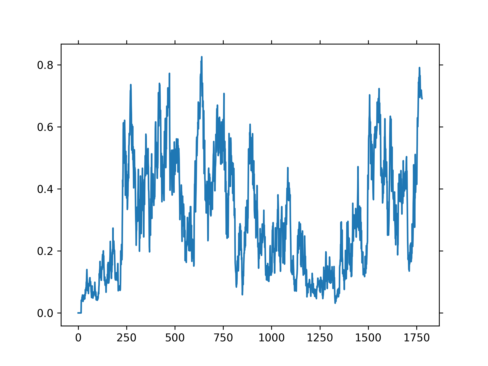

# Real world Anomaly Detection in Surveillance Videos : Pytorch RE-Implementation 

This repository is a re-implementation of "Real-world Anomaly Detection in Surveillance Videos" with pytorch. As a result of our re-implementation, we achieved a much higher AUC than the [original implementation](https://github.com/WaqasSultani/AnomalyDetectionCVPR2018).

## Datasets

Download following data [link](https://drive.google.com/file/d/18nlV4YjPM93o-SdnPQrvauMN_v-oizmZ/view?usp=sharing) and unzip under your $DATA_ROOT_DIR.
/workspace/DATA/UCF-Crime/all_rgbs
* Directory tree
 ```
    DATA/
        UCF-Crime/ 
            ../all_rgbs
                ../~.npy
            ../all_flows
                ../~.npy
        train_anomaly.txt
        train_normal.txt
        test_anomaly.txt
        test_normal.txt
        
```

## train-test script
```
python main.py
```

## Reslut

| METHOD | DATASET | AUC | 
|:--------:|:--------:|:--------:|
| Original paper(C3D two stream) | UCF-Crimes | 75.41 |
| [RTFM](https://arxiv.org/pdf/2101.10030.pdf) (I3D RGB) | UCF-Crimes | 84.03 |
| Ours Re-implementation (I3D two stream) | UCF-Crimes | 84.45 |

## Visualization

<table>
  <tr>
    <td></td> <td>
  <tr>
</table>

## Acknowledgment

This code is heavily borrowed from [Learning to Adapt to Unseen Abnormal Activities under Weak Supervision](https://github.com/junha-kim/Learning-to-Adapt-to-Unseen-Abnormal-Activities) and [AnomalyDetectionCVPR2018](https://github.com/WaqasSultani/AnomalyDetectionCVPR2018).

